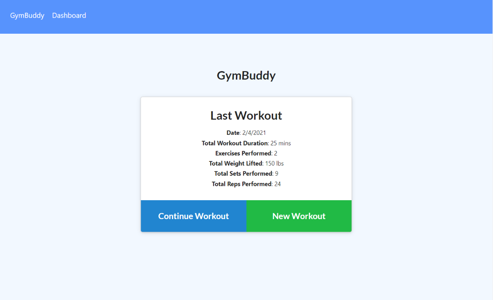
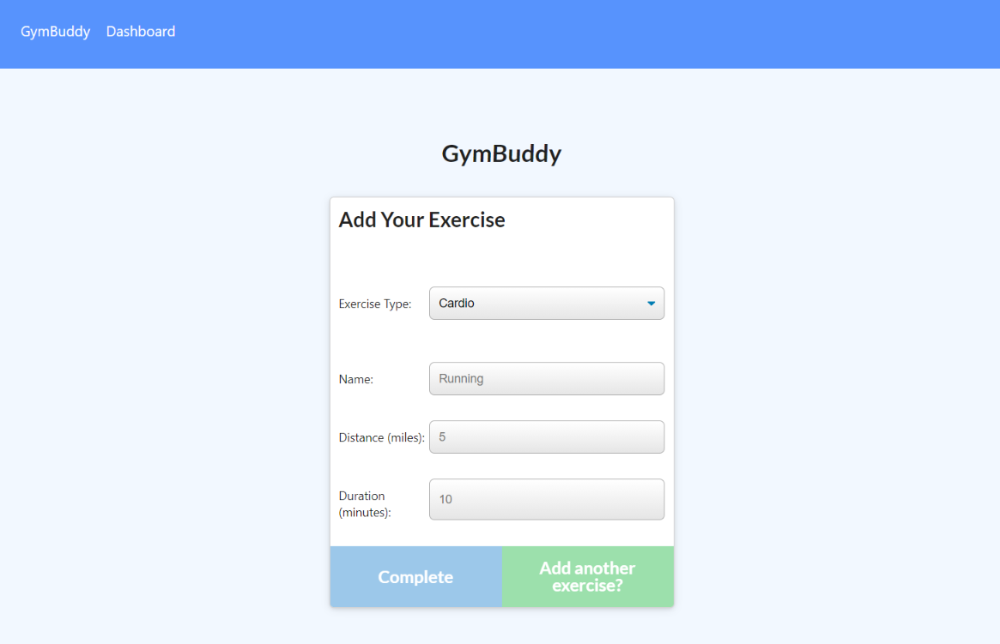
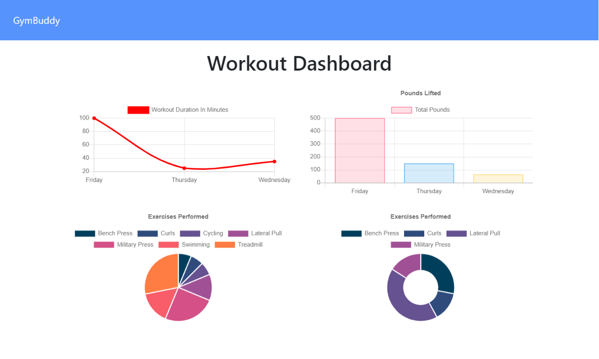

# GymBuddy
<div>
  
  


</div>

### Reach your fitness goals more quickly by using GymBuddy to track your workout progress
<br>

## Table of Contents  
* [Features](#Features)  
* [Installation](#Installation)  
* [Usage](#Usage)  
* [Technologies](#Technologies-Used)
* [Contributing](#Contributing)  
* [Reflection](#Reflection)  
* [Future Scope](#Future-Scope)  
* [Questions](#Questions)

## Features
- Create, view and track your daily workout routines
- Add multiple exercises to any given workout with customizable details
- Visualize stats from your past 7 workouts

## Installation
1. Download project by clicking 

at the top of this repository, and open project directory in terminal.
2. Install npm packages: `express`, `mongoose`, `morgan`
    ```
    npm i express mongoose morgan
    ```
3. (optional) Prepopulate database with data found in [seed.js](seeders/seed.js) file
    ```
    npm run seed
    ```
4. Run `npm start` and navigate to `localhost:8080` in your browser

## Usage
Currently deployed with [Heroku](https://jd-gymbuddy.herokuapp.com/)

1. Start by either creating a new workout or continuing with your most recent workout if you have created one.
2. Add one or more custom exercises to your workout plan, and select `Complete` to return home.
3. Select `Dashboard` on the top menu bar to view combined stats from your past 7 workouts: 
    * View the total duration of each workout
    * View the total pounds lifted in each workout
    * View total combined duration/weight for each individual exercise

    
    
    

## Technologies Used
- [Express](https://expressjs.com/)
- [Morgan](https://www.npmjs.com/package/morgan)
- [Mongoose](https://mongoosejs.com/)
- [MongoDB](https://cloud.mongodb.com/)
- [Chart.js](https://www.chartjs.org/)

## Contributing
Contributions welcome!
1. Fork this repository  
2. Create a new branch  
3. Commit/push your changes  
4. Create a new pull request  

## Reflection
- Gained experience configuring an app for Heroku deployment with MongoDB Atlas
- Inadvertantly gained an understanding of [Chart.js](https://www.chartjs.org/):
    - Discovered issues in provided frontend scripts, so I familiarized myself with the structure and refactored code to manipulate data/display charts correctly.

## Future Scope
- Edit previously added exercises
- Reuse or delete old workouts
- Schedule future workouts?
- Create login system for separate user accounts

## Questions  
If you have any questions, feel free to create an [Issue](https://github.com/JoelDore/gym-buddy/issues) or contact me directly at dore.joel.dore@gmail.com

## License
This project is [MIT](https://github.com/JoelDore/gym-buddy/blob/main/LICENSE) licensed.  
© 2021 [Joel Dore](https://github.com/JoelDore)  

---
<br>

<div align="center">

[](mailto:dore.joel.dore@gmail.com) 
[](https://github.com/JoelDore) 
[](https://www.linkedin.com/in/joeldore) 
<a href="https://www.buymeacoffee.com/JoelDore" target="_blank"></a>

</div>